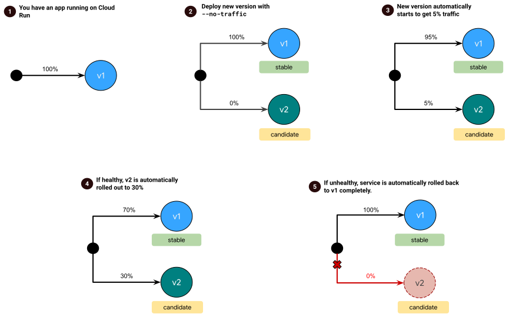

# Cloud Run Progressive Delivery Operator

The Cloud Run Progressive Delivery Operator provides an automated way to
gradually roll out new versions of your Cloud Run services. By using metrics, it
automatically decides to slowly increase traffic to a new version or roll back
to the previous one.

## Usage

```shell
cloud_run_release_operator -cli -project=<YOUR_PROJECT>
```

Once you run this command, it will check the health of Cloud Run services with
the label `rollout-strategy=gradual` every minute by looking at the candidate's
metrics for the past 30 minutes by default.

- The health is determined using the metrics and configured health criteria
- By default, the only health criteria is a expected max server error rate of
1%
- If metrics show a healthy candidate, traffic to candidate is increased
- If metrics show an unhealthy candidate, a roll back is performed

## How does it work?

The Cloud Run Progressive Delivery Operator periodically checks for new
revisions in the services that opted-in for gradual rollouts. If a new revision
with no traffic is found, the operator automatically assigns it some initial
traffic. This new revision is labeled `candidate` while the previous revision
serving traffic is labeled `stable`.

Depending on the candidate's health, traffic to the `candidate` is increased
or traffic to the candidate is dropped and is redirected to the `stable` revision.

### Examples

#### Rollout with no issues

1. I have version **v1** of an application deployed to Cloud Run
2. I deploy a new version, **v2**, to Cloud Run with `--no-traffic` option (gets
0% of the traffic)
3. The new version is automatically detected and assigned 5% of the traffic
4. Every minute, metrics for **v2** in the last 30 minutes are retrieved.
Metrics show a "healthy" version and traffic to **v2** is increased to 30% only
after 30 minutes have passed since last update
5. Metrics show a "healthy" version again and traffic to **v2** is increased to
50% only after 30 minutes have passed since last update
6. The process is repeated until the new version handles all the traffic and
becomes `stable`


#### Rollback

1. I have version **v1** of an application deployed to Cloud Run
2. I deploy a new version, **v2**, to Cloud Run with `--no-traffic` option (gets
0% of the traffic)
3. The new version is automatically detected and assigned 5% of the traffic
4. Every minute, metrics for **v2** in the last 30 minutes are retrieved.
Metrics show a "healthy" version and traffic to **v2** is increased to 30% only
after 30 minutes have passed since last update
5. Metrics for **v2** are retrieved one more time and show an "unhealthy"
version. Traffic to **v2** is inmediately dropped, and all traffic is redirected
to **v1**



## Configuration

Currently, all the configuration arguments must be specified using command line
flags:

### Choosing services

Cloud Run Progressive Delivery Operator can manage the rollout of multiple
services at the same time.

To opt-in a service, the service must have the configured label selector.
By default, services with the label `rollout-strategy=gradual` are looked for in
all regions.

**Note:** A project must be specified.

- `-project`: Google Cloud project in which the Cloud Run services are deployed
- `-regions`: Regions where to look for opted-in services (default: [all
available Cloud Run regions](https://cloud.google.com/run/docs/locations))
- `-label`: The label selector that the opted-in services must have (default:
`rollout-strategy=gradual`)

### Rollout strategy

The rollout strategy consists of the steps and health criteria.

- `-cli-run-interval`: The time between each health check, in seconds (default:
`60`). This is only need it if running with `-cli` option.
- `-healthcheck-offset`: To evaluate the candidate's health, use metrics from
the last `N` minutes relative to current rollout process (default: `30`)
- `-min-requests`: The minimum number of requests needed to determine the
candidate's health (default: `100`)
- `-min-wait`: The minimum time before rolling out further (default: `30m`)
- `-steps`: Percentages of traffic the candidate should go through (default:
`5,20,50,80`)
- `-max-error-rate`: Expected maximum rate (in percent) of server errors
(default: `1`)
- `-latency-p99`: Expected maximum latency for 99th percentile of requests, 0 to
ignore (default: `0`)
- `-latency-p95`: Expected maximum latency for 95th percentile of requests, 0 to
ignore (default: `0`)
- `-latency-p50`: Expected maximum latency for 50th percentile of requests, 0 to
ignore (default: `0`)

---

This is not an official Google project. See [LICENSE](./LICENSE).
