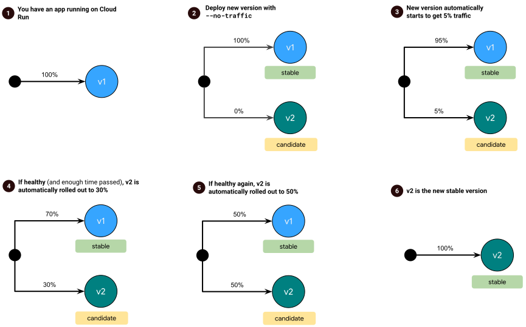

# Cloud Run Release Manager

The Cloud Run Release Manager provides an automated way to gradually roll out
new versions of your Cloud Run services. By using metrics, it automatically
decides to slowly increase traffic to a new version or roll back to the previous
one.

> **Disclaimer:** This project is not an official Google product and is provided
> as-is.
>
> You might encounter issues in production, since this project is currently in
> **alpha**.

## Table of Contents

<!--
  ⚠️ DO NOT UPDATE THE TABLE OF CONTENTS MANUALLY ️️⚠️
  run `npx markdown-toc -i README.md`.

  Please stick to 80-character line wraps as much as you can.
-->

<!-- toc -->

- [How does it work?](#how-does-it-work)
  * [Examples](#examples)
    + [Scenario 1: Automated Rollouts](#scenario-1-automated-rollouts)
    + [Scenario 2: Automated Rollbacks](#scenario-2-automated-rollbacks)
- [Setup on GCP](#setup-on-gcp)
- [Configuration](#configuration)
  * [Choosing services](#choosing-services)
  * [Rollout strategy](#rollout-strategy)
- [Try it out (locally)](#try-it-out-locally)
- [Observability & Troubleshooting](#observability--troubleshooting)
  * [What's happening with my rollout?](#whats-happening-with-my-rollout)
  * [Release Manager logs](#release-manager-logs)

<!-- tocstop -->

## How does it work?

Cloud Run Release Manager is not a built-in Cloud Run feature. It’s an external
tool deployed to your project. It oversees your Cloud Run services (that have
opted-in for gradual rollouts) periodically, detects newly deployed revisions,
monitors their metrics and makes a rollout or rollback decision.

To opt-in services for gradual rollouts, you should [label your services][label]
with `rollout-strategy=gradual` (default value). If a service has a newly
deployed revision with 0% traffic, the Release Manager automatically assigns
some initial traffic to the new revision (5% [by default](#configuration)).

The Release Manager manages 2 revisions at a time: the last revision that
reached 100% of the traffic (tagged as `stable`) and the newest deployment
(tagged as `candidate`).

Depending on the candidate revision’s health and other configurable factors
(such as served request count or time elapsed), this revision is either
gradually rolled out to a higher percentage of traffic, or entirely rolled back.

### Examples

#### Scenario 1: Automated Rollouts

1. I have version **v1** of an application deployed to Cloud Run
2. I deploy a new version, **v2**, to Cloud Run with `--no-traffic` option (gets
0% of the traffic)
3. The new version is automatically detected and assigned 5% of the traffic
4. Every minute, metrics for **v2** in the last 30 minutes are retrieved.
Metrics show a "healthy" version and traffic to **v2** is increased to 30% only
after 30 minutes have passed since last update
5. Metrics show a "healthy" version again and traffic to **v2** is increased to
50% only after 30 minutes have passed since last update
6. The process is repeated until the new version handles all the traffic and
becomes `stable`



#### Scenario 2: Automated Rollbacks

1. I have version **v1** of an application deployed to Cloud Run
2. I deploy a new version, **v2**, to Cloud Run with `--no-traffic` option (gets
0% of the traffic)
3. The new version is automatically detected and assigned 5% of the traffic
4. Every minute, metrics for **v2** in the last 30 minutes are retrieved.
Metrics show a "healthy" version and traffic to **v2** is increased to 30% only
after 30 minutes have passed since last update
5. Metrics for **v2** are retrieved one more time and show an "unhealthy"
version. Traffic to **v2** is inmediately dropped, and all traffic is redirected
to **v1**


## Setup on GCP

Cloud Run Release Manager is distributed as a service deployed to **your GCP
project**, running on Cloud Run and invoked periodically by [Cloud
Scheduler](https://cloud.google.com/scheduler/).

To set up the Release Manager on Cloud Run, run the following steps on your
shell:

1. Set your project ID in a variable:

    ```sh
    PROJECT_ID=<your-project>
    ```

1. Create a new service account:

    ```sh
    gcloud iam service-accounts create release-manager \
        --display-name "Cloud Run Release Manager"
    ```

    Give it permissions to manage your services on the Cloud Run API:

    ```sh
    gcloud projects add-iam-policy-binding $PROJECT_ID \
        --member=serviceAccount:release-manager@${PROJECT_ID}.iam.gserviceaccount.com \
        --role=roles/run.admin
    ```

    Also, give it permissions to use other service accounts as its identity when
    updating Cloud Run services:

    ```sh
    gcloud projects add-iam-policy-binding $PROJECT_ID \
        --member=serviceAccount:release-manager@${PROJECT_ID}.iam.gserviceaccount.com \
        --role=roles/iam.serviceAccountUser
    ```

    Finally, give it access to metrics on your services:

    ```sh
    gcloud projects add-iam-policy-binding $PROJECT_ID \
        --member=serviceAccount:release-manager@${PROJECT_ID}.iam.gserviceaccount.com \
         --role=roles/monitoring.viewer
    ```

1. Build and push the container image for Release Manager to Google container
   Registry.

    ```sh
    git clone https://github.com/GoogleCloudPlatform/cloud-run-release-manager.git
    ```

    ```sh
    gcloud builds submit ./cloud-run-release-manager \
        -t gcr.io/$PROJECT_ID/cloud-run-release-manager
    ```

1. Deploy the Release Manager as a Cloud Run service:

    ```sh
    gcloud run deploy release-manager --quiet \
        --platform=managed \
        --region=us-central1 \
        --image=gcr.io/$PROJECT_ID/cloud-run-release-manager \
        --service-account=release-manager@${PROJECT_ID}.iam.gserviceaccount.com \
        --args=-verbosity=debug \
        --args=-healthcheck-offset=10m \
        --args=-min-requests=0 \
        --args=-max-error-rate=1 \
        --args=-min-wait=10m
    ```

    In the command above, the [configuration options](#configuration) provided
    using `--args` configure how the Cloud Run Release Manager increases or
    drops the traffic to a newly deployed revision:

    - `--args=-healthcheck-offset=10m`: Look back 10 minutes to evaluate a
      new revision’s health while making a rollout or rollback decision.
    - `--args=-min-requests=0`: Do not require a minimum number of requests
      arriving to the new revision while making a rollout decision.
    - `--args=-max-error-rate=1`: Require new revision’s error rate to be &le;1%
      to roll out. If it is &gt;1%, it will be rolled back.
    - `--args=-min-wait=10m`: New revision should stay at least 10 minutes in
      its current percentage before it is rolled out further.
    - `--args=-verbosity=debug`: Log more details from the tool (optional)

    To edit these options later, you can redeploy using the command above, or go
    to [Cloud
    Console](https://console.cloud.google.com/run/deploy/us-central1/release-manager).

    Check out other [configuration options](#configuration) available to more
    finely tune the Release Manager and its rollout strategy.

1. Find the URL of your Cloud Run service and set as `URL` variable:

    ```sh
    URL=$(gcloud run services describe release-manager \
        --platform=managed --region=us-central1 \
        --format='value(status.url)')
    ```

1. Set up a Cloud Scheduler job to call the Release Manager (deployed on Cloud
   Run) every minute:

    ```sh
    gcloud services enable cloudscheduler.googleapis.com
    ```

    ```sh
    gcloud beta scheduler jobs create http cloud-run-release-manager --schedule "* * * * *" \
        --http-method=GET \
        --uri="${URL}/rollout" \
        --oidc-service-account-email=release-manager@${PROJECT_ID}.iam.gserviceaccount.com \
        --oidc-token-audience="${URL}/rollout"
    ```

At this point, you can start deploying services with [label]
`rollout-strategy=gradual` and deploy new revisions with `--no-traffic` option
and the Release Manager will slowly roll it out.

See the [Troubleshooting](#observability--troubleshooting) guide to understand
and observe the rollout status of your services.

## Configuration

Currently, all the configuration options are specified through command-line
arguments.

To customize these options, use the `--args=...` option while deploying this
tool to Cloud Run (e.g. `--args=-min-requests=0`) instead of specifying them
directly on `gcloud run deploy` command.

### Choosing services

Cloud Run Release Manager can manage the rollout of multiple services at the
same time.

To opt-in a Cloud Run service for automated rollouts and rollbacks, the service
must have the [configured a label][label]. By default, services with the label
`rollout-strategy=gradual` are looked for.

- `-project`: Google Cloud project ID that has the Cloud Run services deployed
- `-regions`: Regions where to look for opted-in services (default: [all
available Cloud Run regions](https://cloud.google.com/run/docs/locations))
- `-label`: The [label] selector to match to the opted-in services (default:
`rollout-strategy=gradual`)

### Rollout strategy

The rollout strategy consists of the steps and health criteria.

> ⚠️ **WARNING:** Cloud Monitoring Metrics API has [a reporting delay (up to 3
> minutes)](https://cloud.google.com/monitoring/api/metrics_gcp#gcp-run).
> Therefore, the Release Manager will be subject to the same delay while
> querying the health of a new revision. Configuring the `-healthcheck-offset`
> or `-min-wait` for less than 5 minutes might result in misinterpreting a
> service’s health.


- `-healthcheck-offset`: Time window to look back during health check to assess
the candidate revision's health (default: `30m`).
- `-min-requests`: The minimum number of requests needed to determine the
candidate's health (default: `100`). This minimum value is expected in the time
window determined by `-healthcheck-offset`
- `-min-wait`: The minimum time before rolling out further (default: `30m`)
- `-steps`: Percentages of traffic the candidate should go through (default:
`5,20,50,80`)
- `-max-error-rate`: Expected maximum rate (in percent) of server errors
(default: `1`)
- `-latency-p99`: Expected maximum latency for 99th percentile of requests (in
  milliseconds), 0 to ignore (default: `0`)
- `-latency-p95`: Expected maximum latency for 95th percentile of requests (in
  milliseconds), 0 to ignore (default: `0`)
- `-latency-p50`: Expected maximum latency for 50th percentile of requests (in
  milliseconds), 0 to ignore (default: `0`)
- `-cli-run-interval`: The time between each health check (default: `60s`). This
  is only needed if running with `-cli`.

The time arguments above follow [Go `time.Duration`
syntax](https://golang.org/pkg/time/#ParseDuration) (e.g. 30s, 10m, 1h30m).

## Try it out (locally)

> **Note:** This section applies only if you want to run Cloud Run Release
> Manager locally for troubleshooting, development and demo purposes.

[label]: https://cloud.google.com/run/docs/configuring/labels#set-labels

1. [Label the Cloud Run services][label] (with label `rollout-strategy=gradual`)
   for them to be selected for gradual rollouts:

    ```sh
    gcloud run services update <YOUR_SERVICE> \
      --labels rollout-strategy=gradual \
      --region us-east1
    ```

1. Clone this repository.
1. Make sure you have Go compiler installed, run:

    ```sh
    go build -o cloud_run_release_manager ./cmd/operator
    ```

1. To start the program, run:

    ```sh
    ./cloud_run_release_manager -cli -verbosity=debug -project=<YOUR_PROJECT>
    ```

Once you run this command, it will check the health of Cloud Run services with
the [label] `rollout-strategy=gradual` every minute by looking at the
candidate's metrics for the past 30 minutes by default.

The health is determined using the metrics and configured health criteria. If
metrics show a healthy candidate, traffic to the candidate revision is
increased. But if metrics show an unhealthy candidate, a roll back is performed.

See the [Troubleshooting](#observability--troubleshooting) guide to understand
and observe the rollout status of your services.

## Observability & Troubleshooting

### What's happening with my rollout?

To check the status of your rollout, go to [Cloud
Run](http://console.cloud.google.com/run) and click on your service.

Under the `Revisions` section, you can see how the traffic is currently split
between your stable and candidate revisions.

For more detailed information, you can use the annotations automatically added
by the Release Manager. To view the annotations, click on the `YAML` section:

**Sample annotation:**

```yaml
rollout.cloud.run/stableRevision: hello-00040-opa
rollout.cloud.run/candidateRevision: hello-00039-boc
rollout.cloud.run/lastFailedCandidateRevision: hello-00032-doc
rollout.cloud.run/lastRollout: '2020-08-13T15:35:10-04:00'
rollout.cloud.run/lastHealthReport: |-
  status: healthy
  metrics:
  - request-count: 150 (needs 100)
  - error-rate-percent: 1.00 (needs 1.00)
  - request-latency[p99]: 503.23 (needs 750.00)
  lastUpdate: 2020-08-13T15:35:10-04:00
```

- `rollout.cloud.run/stableRevision` is the name of the current stable revision
- `rollout.cloud.run/candidateRevision` is the revision name of the current
  candidate
- `rollout.cloud.run/lastFailedCandidateRevision` is the last revision that was
  considered a candidate but failed to meet the health criteria at some point of
  its rollout process
- `rollout.cloud.run/lastRollout` contains the last time a rollout occurred
  (traffic to the candidate was increased)
- `rollout.cloud.run/lastHealthReport` contains information on why a rollout or
  rollback occurred. It shows the results of the health assessment and the
  actual values for each of the metrics

### Release Manager logs

Release Manager sends its logs to Cloud Logging. If there’s something preventing
the tool from working properly, it will be logged. However, you can also use the
logs to view a detailed history of the rollout or rollback decisions.

You can quickly find out if there are errors from Release Manager by using the
[Logs Viewer](https://console.cloud.google.com/logs) ([click to run the query
below](https://console.cloud.google.com/logs/viewer?advancedFilter=resource.type%20%3D%20%22cloud_run_revision%22%0Aresource.labels.service_name%20%3D%20%22release-manager%22%0Aresource.labels.location%20%3D%20%22us-central1%22%0Aseverity%20%3E%3D%20ERROR&interval=NO_LIMIT)).

```plain
resource.type = "cloud_run_revision"
resource.labels.service_name = "release-manager"
resource.labels.location = "us-central1"
severity >= ERROR
```

If you want to filter the errors for a specific service, you can include the
service's name in the query:

```plain
jsonPayload.context.data.service = "<YOUR_SERVICE>"
```

You can also include a full list of the logs by changing the severity filter to
`severity >= DEBUG`. You must have set the flag `-verbosity=debug` when
deploying the Release Manager to have full logs about your rollouts.

---

This is not an official Google project. See [LICENSE](./LICENSE).
